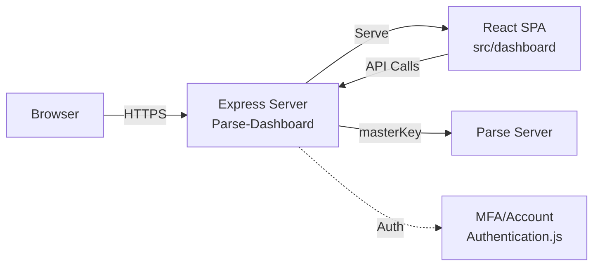

# parse-dashboard

## What it does
Standalone web dashboard for managing Parse Server applications. Provides a React-based UI for browsing data, managing push notifications, viewing analytics, and configuring apps via an Express backend that proxies requests to Parse Server.

## Stack
| Layer | Technology |
|-------|-----------|
| Frontend | React 18, SCSS, Webpack 5 |
| Backend | Node.js, Express |
| Build | Babel, Webpack |
| Testing | Jest |
| Auth | Basic Auth, TOTP (MFA) |

## Architecture

## Run locally
1. `npm install`
2. Create config or set env vars: `PARSE_DASHBOARD_APP_ID`, `PARSE_DASHBOARD_MASTER_KEY`, `PARSE_DASHBOARD_SERVER_URL`
3. `npm start` (or `node Parse-Dashboard/index.js --config parse-dashboard-config.json`)
4. Open http://localhost:4040

## Request flow
1. Browser requests dashboard → Express serves compiled React bundle and index.html
2. React app authenticates user → Dashboard validates credentials against config
3. User browses data → React calls Dashboard REST endpoints (e.g., `/parse/classes/_User`)
4. Dashboard injects masterKey → Proxies request to configured Parse Server URL
5. Parse Server returns JSON → Dashboard forwards to React for rendering in Data Browser

## External dependencies
- **Parse Server**: Backend API being managed (target system)
- **MongoDB/PostgreSQL**: Database underlying Parse Server (indirect dependency)
- **Node.js 18/20/22**: Required runtime (LTS versions only)
